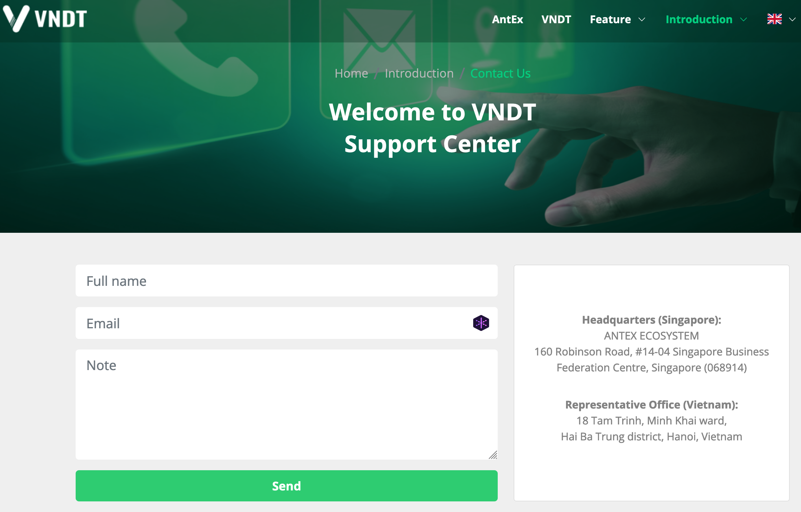
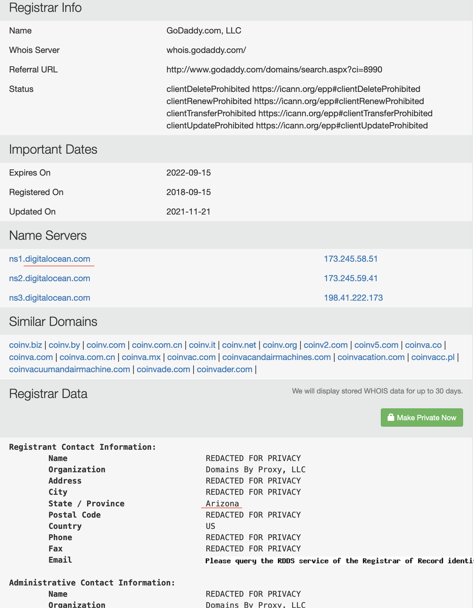
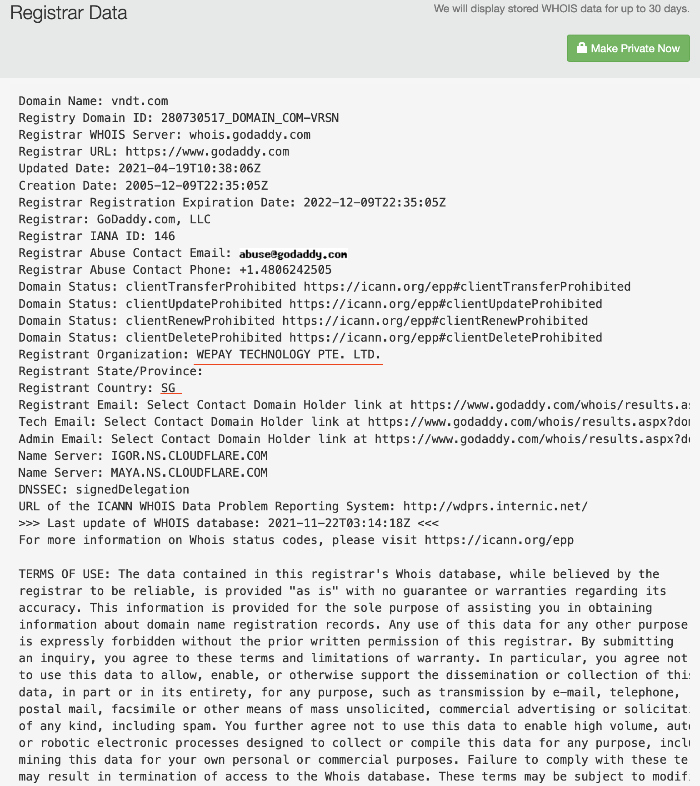

{::options parse_block_html="true" /}
# [Antex](https://antex.org/) Token

## What is it?

  
Coinmarketcap:
  AntEx is a decentralized financial ecosystem 
  

What is AntEx (ANTEX)

AntEx is a decentralized financial ecosystem that provides comprehensive solutions for “Developers, Project Owners, and Community” with outstanding improvements on each product. AntEx ecosystem focuses on: Changes and improvements in financial payment gateways. Build VNDT stablecoin that has the same value as VND fiat and is backed by the most legal organizations. Crypto Asset Management & NFT Start-up incubators for startups DEX - Decentralized exchange Building and providing a blockchain platform AntEx Ecosystem long-term vision and mission: being the most convenient, optimized, and secured platform for “Developers, Project Owners, and Community.”

Who are the founders of AntEx?

AntEx's development team is a dynamic team from around the world, all of whom have extensive knowledge and experience in the crypto market and the fintech field. The founders of AntEx include: Shark Nguyen Hoa Binh is the co-founder, he is currently Group Founder, Chairman & Chief Entrepreneur at Nexttech Group of Technopreneurs. Henry Tran is CEO, Lee Le is CTO (Former CTO of Nexttech Group), Harry Tung is CGO (Founder of 68 Trading), Egan is CPO (Founder of ADN Capital), Van Tran is CFO.

What Makes AntEx Unique?

VNDT stable coin: VNDT is a stable coin, with the rate of 01 VNDT: 01 VND, used for the exchange in between cryptocurrencies and fiat (VND). This is a spearhead product that helps fiat holders access the cryptocurrency market in the easiest and safest way. VNDT stable coin is backed liquidity with VND (rate of 1:1) by Ngan Luong - the payment intermediary licensed by the State Bank of Vietnam.

Transaction and Payment Services: All transactions in between VNDT tokens and VND from VNDT wallet are always guaranteed by Ngan Luong, a payment intermediary licensed by the State Bank of Vietnam. The guarantee ratio is 01 VNDT : 01 VND. Specifically, the Ngan Luong system automatically connects the anti-money laundering assessment system. This is an extremely unique point that makes VNDT Wallet being different from other similar service providers. This is considered as AntEx's flagship product in exposing the entire crypto investment community to a specially connected anti-money laundering assessment system (automatic).

Antex-Blockchain Wallet, Defi Wallet, NFT & Dapp - Secure Cryptocurrency Wallet. Users can discover, store, transfer, view/display NFTs anytime, anywhere. Users can collect multiple swap options (among 8 major DEXs like: Uniswap, Totle, Paraswap, Curve, Airswap, 1 Inch, Ox, etc) and optimized trading fees/prices (Swap AI) by applying smart contract scanning data technology.

AntLaunch and AntLock bring a process for Developer / Project Owner - safe investment place for the investor community with flexibility, decentralization. These features solve current centralized or decentralized Launchpads problems/issues. The users experiment conveniently with features on AntLaunch, while still ensuring absolute security with AntLock's functionality. AntLock: Lock token allows anyone (apply to the Developer / Project Owner of the project) to lock their token. Lock Liquidity allows holders to lock their liquidity pool (LP) tokens for a certain period by sending the LP tokens to a time-locked smart contract. This provides confidence to investors that token developers will not run away with fundraised funds. AntLaunch: ILO Launchpad service provider (Initial liquidity provision) and IDOV - Initial DEX Offering and Vesting is a model of selective fundraising through DEX. With three (03) unique features: Fundraising platform, Listing and Lock liquidity are combined in one Smart Contract.

DEX - Decentralized exchange. Users can: Issue new tokens. Send and receive ANTEX of any user on the DEX. Send tokens on DEX to someone else and get it back accordingly. Freeze and release some tokens if necessary. Burn and destroy tokens if necessary. Send buy or sell orders through community-generated trading pairs. Recommend new trading pairs. Farm One of the important things is that AntEx DEX helps users' funds to be safe and secure their digital assets through-out decentralized wallet applications such as Antex - Blockchain wallet. At the same time, the private key is safely kept by the user. The user takes full control of his private key and money.

AntEx Academy & Research, AntLab will be the place to conduct in-depth research on blockchain technology, security technology, AI - Artificial Intelligence to create core products for the global blockchain market. How Many AntEx (ANTEX) Coins Are There in Circulation?

ANTEX, the token on the AntEx Ecosystem, is a utility or governance token. The total amount of ANTEX tokens issued is 100,000,000,000, issued on Binance Smart Chain - BEP20.

The tokens are allocated as follows: 15% of tokens for marketing, 16% for developing the ecosystem, 5% for the founder team, 15% for developing technical, 10% for reserve funding, 2% for airdrop & bounty, 2% for advisor. For funding rounds: 5% for Seed round, 11% for Private sale, 16% for Pre-sale and another 3% for public sale.

For more information about the ANTEX tokenomics and release schedule, see here How Is the AntEx Network Secured?

ANTEX token is first issued on Binance Smart Chain - BEP20, Smart contract has been audited by CertiK (https://www.certik.org/projects/antex)

  

## Contract
- [github source](https://github.com/Antexchange/Antex-Token/blob/72482b723e232a4056327aa91cf11c8bb820b208/smart-contract.sol) matches to [BSCscan](https://bscscan.com/address/0xca1acab14e85f30996ac83c64ff93ded7586977c#code)

- Code audited by [certik](https://www.certik.org/projects/antex)

    - 10 issues found, 2 majors. Centralization and Initial Token Distribution risks not resolved but acknowledged.
- No developer committed any code or related to the github organization and repository. It may have happened when private repo is used and public repository is just a copy of private one by automation. Still having developers in the repo could show more info.

  
Source

  
~~~ solidity
//SPDX-License-Identifier: Unlicensed
pragma solidity 0.8.6;

/**
 * @dev Interface of the ERC20 standard as defined in the EIP.
 */
interface IERC20 {
    /**
     * @dev Returns the amount of tokens in existence.
     */
    function totalSupply() external view returns (uint256);

    /**
     * @dev Returns the amount of tokens owned by `account`.
     */
    function balanceOf(address account) external view returns (uint256);

    /**
     * @dev Moves `amount` tokens from the caller's account to `recipient`.
     *
     * Returns a boolean value indicating whether the operation succeeded.
     *
     * Emits a {Transfer} event.
     */
    function transfer(address recipient, uint256 amount) external returns (bool);

    /**
     * @dev Returns the remaining number of tokens that `spender` will be
     * allowed to spend on behalf of `owner` through {transferFrom}. This is
     * zero by default.
     *
     * This value changes when {approve} or {transferFrom} are called.
     */
    function allowance(address owner, address spender) external view returns (uint256);

    /**
     * @dev Sets `amount` as the allowance of `spender` over the caller's tokens.
     *
     * Returns a boolean value indicating whether the operation succeeded.
     *
     * IMPORTANT: Beware that changing an allowance with this method brings the risk
     * that someone may use both the old and the new allowance by unfortunate
     * transaction ordering. One possible solution to mitigate this race
     * condition is to first reduce the spender's allowance to 0 and set the
     * desired value afterwards:
     * https://github.com/ethereum/EIPs/issues/20#issuecomment-263524729
     *
     * Emits an {Approval} event.
     */
    function approve(address spender, uint256 amount) external returns (bool);

    /**
     * @dev Moves `amount` tokens from `sender` to `recipient` using the
     * allowance mechanism. `amount` is then deducted from the caller's
     * allowance.
     *
     * Returns a boolean value indicating whether the operation succeeded.
     *
     * Emits a {Transfer} event.
     */
    function transferFrom(
        address sender,
        address recipient,
        uint256 amount
    ) external returns (bool);

    /**
     * @dev Emitted when `value` tokens are moved from one account (`from`) to
     * another (`to`).
     *
     * Note that `value` may be zero.
     */
    event Transfer(address indexed from, address indexed to, uint256 value);

    /**
     * @dev Emitted when the allowance of a `spender` for an `owner` is set by
     * a call to {approve}. `value` is the new allowance.
     */
    event Approval(address indexed owner, address indexed spender, uint256 value);
}

/**
 * @dev Contract module that helps prevent reentrant calls to a function.
 *
 * Inheriting from `ReentrancyGuard` will make the {nonReentrant} modifier
 * available, which can be applied to functions to make sure there are no nested
 * (reentrant) calls to them.
 *
 * Note that because there is a single `nonReentrant` guard, functions marked as
 * `nonReentrant` may not call one another. This can be worked around by making
 * those functions `private`, and then adding `external` `nonReentrant` entry
 * points to them.
 *
 * TIP: If you would like to learn more about reentrancy and alternative ways
 * to protect against it, check out our blog post
 * https://blog.openzeppelin.com/reentrancy-after-istanbul/[Reentrancy After Istanbul].
 */
abstract contract ReentrancyGuard {
    // Booleans are more expensive than uint256 or any type that takes up a full
    // word because each write operation emits an extra SLOAD to first read the
    // slot's contents, replace the bits taken up by the boolean, and then write
    // back. This is the compiler's defense against contract upgrades and
    // pointer aliasing, and it cannot be disabled.

    // The values being non-zero value makes deployment a bit more expensive,
    // but in exchange the refund on every call to nonReentrant will be lower in
    // amount. Since refunds are capped to a percentage of the total
    // transaction's gas, it is best to keep them low in cases like this one, to
    // increase the likelihood of the full refund coming into effect.
    uint256 private constant _NOT_ENTERED = 1;
    uint256 private constant _ENTERED = 2;

    uint256 private _status;

    constructor() {
        _status = _NOT_ENTERED;
    }

    /**
     * @dev Prevents a contract from calling itself, directly or indirectly.
     * Calling a `nonReentrant` function from another `nonReentrant`
     * function is not supported. It is possible to prevent this from happening
     * by making the `nonReentrant` function external, and make it call a
     * `private` function that does the actual work.
     */
    modifier nonReentrant() {
        // On the first call to nonReentrant, _notEntered will be true
        require(_status != _ENTERED, "ReentrancyGuard: reentrant call");

        // Any calls to nonReentrant after this point will fail
        _status = _ENTERED;

        _;

        // By storing the original value once again, a refund is triggered (see
        // https://eips.ethereum.org/EIPS/eip-2200)
        _status = _NOT_ENTERED;
    }
}

// CAUTION
// This version of SafeMath should only be used with Solidity 0.8 or later,
// because it relies on the compiler's built in overflow checks.

/**
 * @dev Wrappers over Solidity's arithmetic operations.
 *
 * NOTE: `SafeMath` is no longer needed starting with Solidity 0.8. The compiler
 * now has built in overflow checking.
 */
library SafeMath {
    /**
     * @dev Returns the addition of two unsigned integers, with an overflow flag.
     *
     * _Available since v3.4._
     */
    function tryAdd(uint256 a, uint256 b) internal pure returns (bool, uint256) {
    unchecked {
        uint256 c = a + b;
        if (c < a) return (false, 0);
        return (true, c);
    }
    }

    /**
     * @dev Returns the substraction of two unsigned integers, with an overflow flag.
     *
     * _Available since v3.4._
     */
    function trySub(uint256 a, uint256 b) internal pure returns (bool, uint256) {
    unchecked {
        if (b > a) return (false, 0);
        return (true, a - b);
    }
    }

    /**
     * @dev Returns the multiplication of two unsigned integers, with an overflow flag.
     *
     * _Available since v3.4._
     */
    function tryMul(uint256 a, uint256 b) internal pure returns (bool, uint256) {
    unchecked {
        // Gas optimization: this is cheaper than requiring 'a' not being zero, but the
        // benefit is lost if 'b' is also tested.
        // See: https://github.com/OpenZeppelin/openzeppelin-contracts/pull/522
        if (a == 0) return (true, 0);
        uint256 c = a * b;
        if (c / a != b) return (false, 0);
        return (true, c);
    }
    }

    /**
     * @dev Returns the division of two unsigned integers, with a division by zero flag.
     *
     * _Available since v3.4._
     */
    function tryDiv(uint256 a, uint256 b) internal pure returns (bool, uint256) {
    unchecked {
        if (b == 0) return (false, 0);
        return (true, a / b);
    }
    }

    /**
     * @dev Returns the remainder of dividing two unsigned integers, with a division by zero flag.
     *
     * _Available since v3.4._
     */
    function tryMod(uint256 a, uint256 b) internal pure returns (bool, uint256) {
    unchecked {
        if (b == 0) return (false, 0);
        return (true, a % b);
    }
    }

    /**
     * @dev Returns the addition of two unsigned integers, reverting on
     * overflow.
     *
     * Counterpart to Solidity's `+` operator.
     *
     * Requirements:
     *
     * - Addition cannot overflow.
     */
    function add(uint256 a, uint256 b) internal pure returns (uint256) {
        return a + b;
    }

    /**
     * @dev Returns the subtraction of two unsigned integers, reverting on
     * overflow (when the result is negative).
     *
     * Counterpart to Solidity's `-` operator.
     *
     * Requirements:
     *
     * - Subtraction cannot overflow.
     */
    function sub(uint256 a, uint256 b) internal pure returns (uint256) {
        return a - b;
    }

    /**
     * @dev Returns the multiplication of two unsigned integers, reverting on
     * overflow.
     *
     * Counterpart to Solidity's `*` operator.
     *
     * Requirements:
     *
     * - Multiplication cannot overflow.
     */
    function mul(uint256 a, uint256 b) internal pure returns (uint256) {
        return a * b;
    }

    /**
     * @dev Returns the integer division of two unsigned integers, reverting on
     * division by zero. The result is rounded towards zero.
     *
     * Counterpart to Solidity's `/` operator.
     *
     * Requirements:
     *
     * - The divisor cannot be zero.
     */
    function div(uint256 a, uint256 b) internal pure returns (uint256) {
        return a / b;
    }

    /**
     * @dev Returns the remainder of dividing two unsigned integers. (unsigned integer modulo),
     * reverting when dividing by zero.
     *
     * Counterpart to Solidity's `%` operator. This function uses a `revert`
     * opcode (which leaves remaining gas untouched) while Solidity uses an
     * invalid opcode to revert (consuming all remaining gas).
     *
     * Requirements:
     *
     * - The divisor cannot be zero.
     */
    function mod(uint256 a, uint256 b) internal pure returns (uint256) {
        return a % b;
    }

    /**
     * @dev Returns the subtraction of two unsigned integers, reverting with custom message on
     * overflow (when the result is negative).
     *
     * CAUTION: This function is deprecated because it requires allocating memory for the error
     * message unnecessarily. For custom revert reasons use {trySub}.
     *
     * Counterpart to Solidity's `-` operator.
     *
     * Requirements:
     *
     * - Subtraction cannot overflow.
     */
    function sub(
        uint256 a,
        uint256 b,
        string memory errorMessage
    ) internal pure returns (uint256) {
    unchecked {
        require(b <= a, errorMessage);
        return a - b;
    }
    }

    /**
     * @dev Returns the integer division of two unsigned integers, reverting with custom message on
     * division by zero. The result is rounded towards zero.
     *
     * Counterpart to Solidity's `/` operator. Note: this function uses a
     * `revert` opcode (which leaves remaining gas untouched) while Solidity
     * uses an invalid opcode to revert (consuming all remaining gas).
     *
     * Requirements:
     *
     * - The divisor cannot be zero.
     */
    function div(
        uint256 a,
        uint256 b,
        string memory errorMessage
    ) internal pure returns (uint256) {
    unchecked {
        require(b > 0, errorMessage);
        return a / b;
    }
    }

    /**
     * @dev Returns the remainder of dividing two unsigned integers. (unsigned integer modulo),
     * reverting with custom message when dividing by zero.
     *
     * CAUTION: This function is deprecated because it requires allocating memory for the error
     * message unnecessarily. For custom revert reasons use {tryMod}.
     *
     * Counterpart to Solidity's `%` operator. This function uses a `revert`
     * opcode (which leaves remaining gas untouched) while Solidity uses an
     * invalid opcode to revert (consuming all remaining gas).
     *
     * Requirements:
     *
     * - The divisor cannot be zero.
     */
    function mod(
        uint256 a,
        uint256 b,
        string memory errorMessage
    ) internal pure returns (uint256) {
    unchecked {
        require(b > 0, errorMessage);
        return a % b;
    }
    }
}

/**
 * @dev Provides information about the current execution context, including the
 * sender of the transaction and its data. While these are generally available
 * via msg.sender and msg.data, they should not be accessed in such a direct
 * manner, since when dealing with meta-transactions the account sending and
 * paying for execution may not be the actual sender (as far as an application
 * is concerned).
 *
 * This contract is only required for intermediate, library-like contracts.
 */
abstract contract Context {
    function _msgSender() internal view virtual returns (address) {
        return msg.sender;
    }

    function _msgData() internal view virtual returns (bytes calldata) {
        return msg.data;
    }
}

/**
 * @dev Contract module which provides a basic access control mechanism, where
 * there is an account (an owner) that can be granted exclusive access to
 * specific functions.
 *
 * By default, the owner account will be the one that deploys the contract. This
 * can later be changed with {transferOwnership}.
 *
 * This module is used through inheritance. It will make available the modifier
 * `onlyOwner`, which can be applied to your functions to restrict their use to
 * the owner.
 */
abstract contract Ownable is Context {
    address private _owner;

    event OwnershipTransferred(address indexed previousOwner, address indexed newOwner);

    /**
     * @dev Initializes the contract setting the deployer as the initial owner.
     */
    constructor() {
        _setOwner(_msgSender());
    }

    /**
     * @dev Returns the address of the current owner.
     */
    function owner() public view virtual returns (address) {
        return _owner;
    }

    /**
     * @dev Throws if called by any account other than the owner.
     */
    modifier onlyOwner() {
        require(owner() == _msgSender(), "Ownable: caller is not the owner");
        _;
    }

    /**
     * @dev Leaves the contract without owner. It will not be possible to call
     * `onlyOwner` functions anymore. Can only be called by the current owner.
     *
     * NOTE: Renouncing ownership will leave the contract without an owner,
     * thereby removing any functionality that is only available to the owner.
     */
    function renounceOwnership() external virtual onlyOwner {
        _setOwner(address(0));
    }

    /**
     * @dev Transfers ownership of the contract to a new account (`newOwner`).
     * Can only be called by the current owner.
     */
    function transferOwnership(address newOwner) external virtual onlyOwner {
        require(newOwner != address(0), "Ownable: new owner is the zero address");
        _setOwner(newOwner);
    }

    function _setOwner(address newOwner) private {
        address oldOwner = _owner;
        _owner = newOwner;
        emit OwnershipTransferred(oldOwner, newOwner);
    }
}

contract AntexToken is Context, IERC20, Ownable, ReentrancyGuard {
    using SafeMath for uint256;

    string public constant symbol = "ANTEX";
    string public constant name = "Antex";
    uint256 public constant decimals = 8;

    mapping(address => uint) public balances;
    mapping(address => mapping(address => uint)) public allowed;
    address public constant deadWallet = address(0x000000000000000000000000000000000000dEaD);
    mapping(address => bool) public isBlackListed;
    uint256 public _totalSupply = 100 * (10 ** 9) * (10 ** decimals);

    event SeizeBlackFunds(address indexed _blackListedUser, uint256 _balance);
    event AddedBlackList(address indexed _user);
    event RemovedBlackList(address indexed _user);
    event BurnSupply(address indexed _user, uint256 _amount);

    constructor() {
        balances[msg.sender] = _totalSupply;
        emit Transfer(address(0), msg.sender, _totalSupply);
    }
    function totalSupply() external view override returns (uint256) {
        return _totalSupply;
    }

    function balanceOf(address tokenOwner) public view override returns (uint256 balance) {
        return balances[tokenOwner];
    }

    function transfer(address to, uint256 tokens) external override returns (bool success) {
        require(!isBlackListed[msg.sender], "ADDRESS IS BLACKLISTED");
        require(to != address(0), "RECEIVE ADDRESS IS A ZERO ADDRESS");
        balances[msg.sender] = balances[msg.sender].sub(tokens);
        balances[to] = balances[to].add(tokens);
        emit Transfer(msg.sender, to, tokens);
        return true;
    }

    function batchTransfer(address[] memory _receivers, uint256[] memory _amounts) external nonReentrant {
        require(!isBlackListed[msg.sender], "ADDRESS IS BLACKLISTED");
        uint256 cnt = _receivers.length;
        require(cnt > 0 && cnt <= 100);
        require(cnt == _amounts.length);
        cnt = (uint8)(cnt);
        uint256 totalAmount = 0;
        for (uint8 i = 0; i < cnt; i++) {
            require(_receivers[i] != address(0), "RECEIVE ADDRESS IS A ZERO ADDRESS");
            totalAmount = totalAmount.add(_amounts[i]);
        }
        require(totalAmount <= balances[msg.sender], "BALANCE IS NOT ENOUGH");
        balances[msg.sender] = balances[msg.sender].sub(totalAmount);
        for (uint256 i = 0; i < cnt; i++) {
            balances[_receivers[i]] = balances[_receivers[i]].add(_amounts[i]);
            emit Transfer(msg.sender, _receivers[i], _amounts[i]);
        }
    }

    function approve(address spender, uint256 tokens) external override returns (bool success) {
        allowed[msg.sender][spender] = tokens;
        emit Approval(msg.sender, spender, tokens);
        return true;
    }

    function transferFrom(address from, address to, uint256 tokens) external override returns (bool success) {
        require(!isBlackListed[from], "ADDRESS IS BLACKLISTED");
        require(to != address(0), "RECEIVE ADDRESS IS A ZERO ADDRESS");
        balances[from] = balances[from].sub(tokens);
        allowed[from][msg.sender] = allowed[from][msg.sender].sub(tokens);
        balances[to] = balances[to].add(tokens);
        emit Transfer(from, to, tokens);
        return true;
    }

    function allowance(address tokenOwner, address spender) external override view returns (uint256 remaining) {
        return allowed[tokenOwner][spender];
    }

    function transferAnyERC20Token(address tokenAddress, uint256 tokens) external onlyOwner returns (bool success) {
        return IERC20(tokenAddress).transfer(owner(), tokens);
    }

    function burnDead(uint256 _value) external nonReentrant {
        require(balances[msg.sender] >= _value, "BALANCE IS NOT ENOUGH");
        balances[msg.sender] = balances[msg.sender].sub(_value);
        balances[deadWallet] = balances[deadWallet].add(_value);
        emit Transfer(msg.sender, deadWallet, _value);
    }

    function burnSupply(uint256 _value) external nonReentrant {
        require(balances[msg.sender] >= _value, "BALANCE IS NOT ENOUGH");
        balances[msg.sender] = balances[msg.sender].sub(_value);
        _totalSupply -= _value;
        emit BurnSupply(msg.sender, _value);
    }

    /////// Getters to allow the same blacklist to be used also by other contracts ///////
    function getBlackListStatus(address _maker) external view returns (bool) {
        return isBlackListed[_maker];
    }

    function addBlackList(address _evilUser) external onlyOwner {
        isBlackListed[_evilUser] = true;
        emit AddedBlackList(_evilUser);
    }

    function removeBlackList(address _clearedUser) external onlyOwner {
        isBlackListed[_clearedUser] = false;
        emit RemovedBlackList(_clearedUser);
    }

    function seizeBlackFunds(address _blackListedUser) external onlyOwner {
        require(isBlackListed[_blackListedUser], "ADDRESS IS NOT BLACKLISTED");
        uint256 dirtyFunds = balanceOf(_blackListedUser);
        balances[_blackListedUser] = 0;
        balances[address(this)] = balances[address(this)].add(dirtyFunds);
        emit Transfer(_blackListedUser, address(this), dirtyFunds);
        emit SeizeBlackFunds(_blackListedUser, dirtyFunds);
    }
}
~~~

 

## Organization
There is an ERC-20 based stable coin ([VNDT](https://coinmarketcap.com/currencies/vendit/)) but doesn't look related to antex. Also it doesn't look very stable to me, even with [vietnamese đồng](https://www.coingecko.com/en/coins/vendit/vnd). It launched Sep 1, 2021.

2 websites associated with "vndt":

- https://vndt.com (the wallet of antex)
- https://coinvendit.io (current coin in the market)

They look different as the teams and addresses are different and there is no link between them. vndt stablecoin website in the coinmarketcap and coingecco point to coinvendit.io.

Coinvendit address is in the US but vndt is in Singapore and Vietnam.

{:target="_blank"}

{:target="_blank"}

VNDT and ANTEX linked to another company "wepay". Whois of the domains can confirm such strong relation but no link to coinvendit.

It seems they use different infra for DNS as another sign of no relation.

{:target="_blank"}

{:target="_blank"}

### Wepay 

[Here](https://www.sgpbusiness.com/company/Wepay-Technology-Pte-Ltd#Corporate-Profile) is some business info about the company. VNDT app linked to this company here.

## Team

CEO seems to have related experience but CTO profile looks sparse and unrelated.

{:target="_blank"}

{:target="_blank"}

To Be Continued...